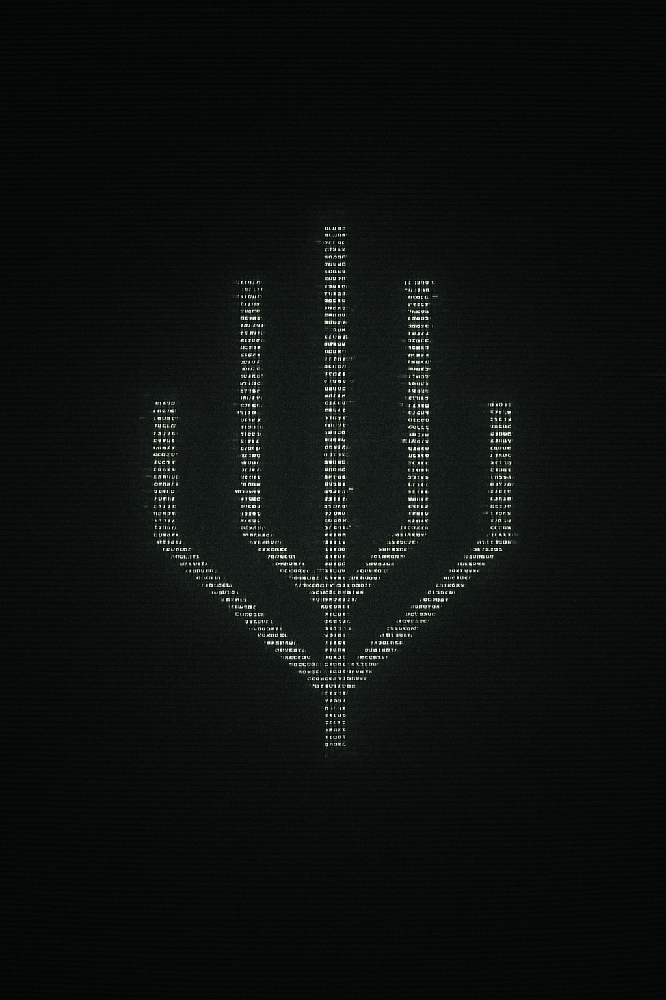

# THE SEED - A Book Series

## Overview

"THE SEED" is a multi-book series spanning from ancient pre-Columbian times to a post-human future. It follows the discovery and unfolding mystery of **The Seed Symbol**, a recurring motif that appears across time and space, connecting ancient wisdom, human evolution, technological advancement, and the ultimate destiny of consciousness.

## The Seed Symbol

The core of the series revolves around a mysterious symbol that manifests in various forms throughout history and into the future:

- Ancient temple carvings
- DNA sequences
- Modern architectural elements
- Secret society insignia
- Spacecraft designs

This symbol acts as a map, an evolutionary trigger, a blueprint, a guide, and a universal pattern.

 *<-- Placeholder for Seed Symbol Image*

## Series Progression

Each book delves into a distinct era, revealing new facets of The Seed's nature and purpose while maintaining thematic continuity.

---

### 1. The Stone of Origins
- **Time Period**: Present day
- **Location**: A global journey starting in Oaxaca, Mexico, traversing ancient sites and modern hubs (Giza, Kyoto, NYC, Geneva).
- **Focus**: Discovery and ancient wisdom. Archaeologist Ava Castillo uncovers a hidden temple in Oaxaca featuring the Seed symbol, leading her on a global chase for clues across ancient sites while being pursued by a shadowy organization seeking the symbol's power.
-  *<-- Placeholder*

---

### 2. The Society of the Veil
- **Time Period**: Present day
- **Location**: European underground
- **Focus**: Power and knowledge. Explores a secret society, their rituals, and the symbol as a religious artifact tied to an Ascension prophecy.
-  *<-- Placeholder*

---

### 3. Echoes in the Helix
- **Time Period**: Near future
- **Location**: Genetic research facilities
- **Focus**: Evolution and responsibility. Focuses on DNA manipulation, evolutionary triggers, corporate conspiracy, and scientific discovery.
-  *<-- Placeholder*

---

### 4. Arcology Ascendance
- **Time Period**: Mid-future
- **Location**: Futuristic cityscapes
- **Focus**: Harmony and balance. Deals with sustainable architecture, urban transformation, social upheaval, and technological integration.
-  *<-- Placeholder*

---

### 5. Dominion of the Skies
- **Time Period**: Far future
- **Location**: Interstellar space
- **Focus**: Exploration and destiny. Centers on space exploration, generation ships, celestial navigation using The Seed, and human destiny among the stars.
-  *<-- Placeholder*

---

### 6. The Seed Eternal
- **Time Period**: Post-human era
- **Location**: Digital-physical hybrid realm
- **Focus**: Transcendence and continuity. Explores AI consciousness, universal patterns, eternal cycles, legacy, and renewal.
-  *<-- Placeholder*

---

## Core Themes

The series explores profound themes woven through its epic timeline:

1.  **Evolution and Transformation**: Personal, species, technological, and consciousness evolution.
2.  **Knowledge and Power**: The discovery, exploitation, wisdom, control, and responsibility associated with knowledge.
3.  **Unity and Balance**: The interplay between technology/nature, past/future, individual/collective, and physical/digital realms.
4.  **Destiny and Choice**: The tension between predetermined paths, free will, collective destiny, and individual agency. 