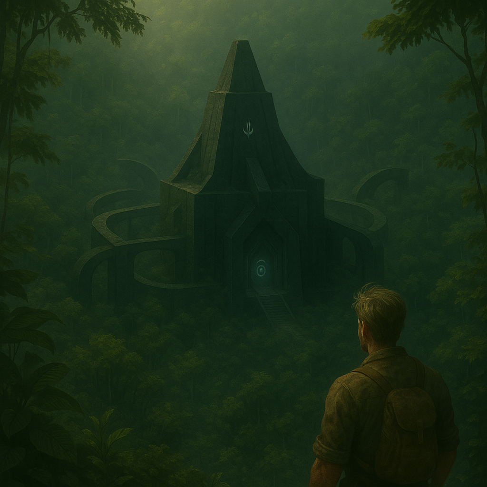

# Chapter 2: Temple of Whispers

*Okay, Alex,* he thought, heart pounding a frantic drum solo against his ribs. *Rule one: When you find architecture that makes Escher look straightforward, maybe check your water bottle for psychedelic frog residue.*

*"Bio-scans negative for hallucinogens, Alex,"* Kai chimed in, ever helpful. *"Though your adrenaline levels *are* trying to set a new world record. Deep breaths. What you're seeing? Yeah, it's actually there. Unless we're both hallucinating, which would be a fascinating shared psychosis."*

Alex blinked. The impossible black stone structure remained, smooth, dark, utterly solid. "Well," he whispered, the sound swallowed by the sudden, unnatural silence, "at least it's not giant spiders. Small victories."

*"Always look on the bright side,"* Kai agreed. *"Though statistically, giant spiders are probably less dangerous than reality-bending geometry built by... well, whoever built this."*

This wasn't just a random block. It was *shaped*. Purposefully. Curving upwards with a grace both ancient and disturbingly futuristic, like a Maya stele redesigned by someone with access to anti-gravity and a serious minimalist streak. The lines carved into its surface... he leaned closer. Not decoration. They flowed like liquid circuits, branching and merging with a logic that felt mathematical, but alien. "Maybe it's just the world's weirdest plumbing diagram?"

*"Highly intricate plumbing, then,"* Kai mused. *"Or maybe wiring. Or maybe just art by beings who considered the fourth dimension a good starting point. Reaching out? Bold move, Alex."*

He touched it. Solid. Cool. Unnaturally cool. Fingers traced the perfectly recessed lines. The surface felt like polished obsidian yet seemed to *drink* the light. He ran his hand wider. No tool marks. Not a single scar. Rapping his knuckles produced a dull, dead *thud*. Scraping it with his machete? The hardened steel skittered off without a scratch.

*"Material analysis inconclusive,"* Kai reported, a hint of digital frustration in its voice. *"Hardness off the charts. Composition doesn't match any known element or alloy. It's like... concentrated darkness given form. Want me to deploy a micro-drone for a closer look? 'Spot' needs some exercise."*

"Good idea, Kai. Keep Spot on a tight leash though." Alex followed the curve of the wall, pushing aside thick moss. It plunged *down*, fusing seamlessly with the earth, and stretched *sideways*, vanishing into the jungle. It wasn't built *on* the land; it seemed to *grow* from it.

The geometry messed with his head. Angles shifted subtly. Lines revealed gentle curves. Corners weren't quite square. It felt like reality was flexing around him. *"Getting some M.C. Escher vibes here?"* Kai asked. *"Because my visual processors are currently arguing about perspective and basic physics. Fun times."*

He pushed through waxy leaves, swatting insects, and stumbled into a clearing. Heart hammered – terror mixed with giddy exhilaration. More structures rose through the foliage. Towers spiraling? Platforms cantilevered impossibly? Walls intersecting at baffling angles? All the same seamless black stone, all humming with that low, pervasive vibration that resonated in his bones.

An entire complex. Swallowed, hidden, preserved. Impossibly, perfectly preserved. No crumbling, no cracks, just a green shroud of moss. *"Yeah, this isn't normal,"* Kai stated unnecessarily. *"Jungle this aggressive? Usually eats ruins for breakfast. This place looks like it told the jungle 'No thanks, I'm good' and the jungle actually *listened*. Spooky."

*"Drone feed coming online,"* Kai announced. *"Spot is airborne. Getting a better view... whoa."* On Alex's wrist device, a bird's-eye view flickered into life, showing the complex layout – elegant, alien, and radiating that weird energy signature Kai had detected earlier.

As Alex stepped further into the clearing, the hum intensified sharply. It vibrated through his skull, vision swimming. The impossible geometry seemed to *writhe*. Vertigo slammed into him. He staggered, boot catching an exposed root.

Down hard. Knee cracked against stone. Pain, white-hot and blinding. Nausea. The hum roared. *Get out. Wrong place,* screamed his primal brain.

*"Alex!"* Kai's voice was sharp. *"Damage assessment! Talk to me!"*

He squeezed his eyes shut, forcing breath through the pain. *Easy, Castillo.* The roaring separated from the hum. Dizziness faded, leaving fear and a throbbing knee.

He opened his eyes. The world swam back. Flexed his knee. Agony. But movable. "Bruised. Maybe sprained. I'm okay," he grunted.

*"Define 'okay',"* Kai retorted, but its tone softened slightly. *"Vitals stabilizing. Did... did the place *do* that? The energy spike coincided exactly with your fall."*

"Maybe," Alex pushed himself up, leaning on the machete. "Or maybe I'm just clumsy." The hum was constant, a pressure, but the disorientation eased. Turning back wasn't an option. He focused on the largest structure ahead, dominating the circular clearing.

It rose towards the canopy, a symphony of impossible geometry. Layers folded like origami. Curves intersected planes. Archways opened onto sheer faces. Lines converged and diverged, making his eyes ache. It looked *composed*. It pulsed with the deep hum, like a giant sleeping machine.

*"Okay, that central building?"* Kai sounded almost breathless. *"It's the source of the main energy signature. And the geometry... it's generating subtle spatial distortions, according to Spot's sensors. Nothing dangerous, probably. Just... reality-warping."*

And the entrance... a perfect, arching void carved into the base. Absolute darkness swallowing the dim light. Watchful. Intent. Cold spilled out, smelling of caves, dust, and ozone.

*"Definitely an entrance,"* Kai murmured. *"Definitely not welcoming. Looks like it eats light for snacks. Suggest extreme caution? Or maybe just send the drone in first? Spot is surprisingly brave."*

"Let's not sacrifice Spot just yet." Alex took a step. Then another. Pulled by sheer novelty, stronger than fear. Near the threshold, the hum intensifying, cold prickling his skin, his boot scuffed something hard.

He paused. Looked down. The floor was the same black stone. But where his boot slid, something was different. Integrated *within* the stone, filled with a material glowing faintly – soft, milky white light pulsing with the hum.

A symbol. Complex spiral, geometric offshoots, intricate symmetry.

A symbol he knew.

"Kai," he breathed, tapping his wrist device to send the visual. "Cross-reference. Now."

*"Running... cross-referencing... Alex. Multiple high-probability matches. Armitage's map data. Your private research files - the controversial ones. Fragments from the Loyola Jesuit Archives regarding 'lapis sementis'... It's here, Alex. Unmistakable."*

The Seed glyph. 